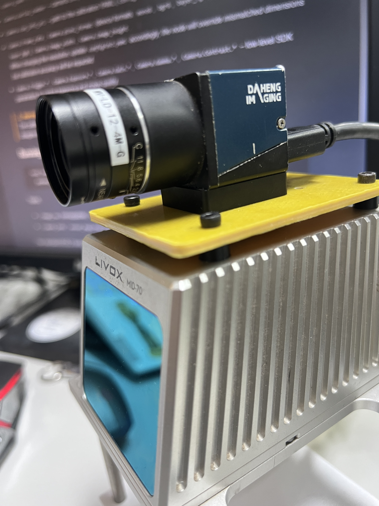

# Galaxy-Camera-ROS2
---

**ROS 2 driver for Daheng Galaxy industrial cameras (大恒工业相机驱动).** The node configures a device through the official Galaxy SDK, converts the Bayer stream to color images and publishes synchronized `image_raw` and `camera_info` topics for downstream perception components.(颜色已完全矫正)

<p align="center">
  
  
</p>
<p align="center">
  <sub>大恒工业相机 MER-139-210U3C   |    效果展示-感谢董的萝卜君友情出演😄</sub>
</p>


---

## Requirements

- ROS 2 Humble with `rclcpp`, `image_transport`, `camera_info_manager`
- Daheng Galaxy SDK (`/opt/Galaxy/`, `libgxiapi.so`, `DxImageProc.so` etc.) installed on the system
---
## Build

```bash
cd ~/ros2_ws/src
git clone https://github.com/BreCaspian/Galaxy-Camera-ROS2.git galaxy_camera_ros2
cd ..
source /opt/ros/humble/setup.bash
colcon build --packages-select galaxy_camera_ros2
source install/setup.bash
```
---
## Configuration

Runtime settings live in `config/camera.yaml`, which is a ROS 2 parameter file following the standard
`<node_name>.ros__parameters` layout:

```yaml
galaxy_camera_ros2:
  ros__parameters:
    camera_name: galaxy_camera_ros2
    Camera:
      pixel_format: bgr8  # allowed values: mono8, bgr8
      serial_number: ""
      cam_info_url: package://galaxy_camera_ros2/config/ost.yaml
      # ...
```

Important fields include:

- `camera_name` / `camera_frame_id` – frame metadata stamped on every message.
- `Camera.serial_number` – camera SN (leave empty to open the first detected device).
- `Camera.cam_info_url` – path to the calibration YAML (`config/ost.yaml` by default).
- `Camera.frame_rate`, `Camera.pixel_format` (device formats: `mono8`, `bgr8`, `bayer_rg8`, `bayer_gr8`, `bayer_gb8`, `bayer_bg8`), `Camera.image_width`, `Camera.image_height`.  
  *When changing the resolution, update `config/ost.yaml` accordingly; the node will override mismatched dimensions but calibration accuracy will be impacted.*
- `Camera.Trigger.*`, `Camera.Exposure.*`, `Camera.Gain.*`, `Camera.Gamma.*`, `Camera.Contrast.*` – low-level SDK parameters to control triggering and image quality.

> [!WARNING]
> The calibration file `config/ost.yaml` must match the output resolution; the driver will abort if the dimensions disagree in order to avoid publishing inconsistent camera models.
---
## Running

```bash
ros2 launch galaxy_camera_ros2 galaxy_camera.launch.py \
  params_file:=/path/to/galaxy_camera_ros2/config/camera.yaml
```

Topics:

- `/image_raw` (remappable): `sensor_msgs/msg/Image` with `SensorDataQoS`
- `/camera_info`: `sensor_msgs/msg/CameraInfo` synchronized with the image timestamp

Use standard ROS 2 tools for visualization or playback:

**View Image in RQt**
```bash
ros2 run rqt_image_view rqt_image_view
```
Select /image_raw.
```bash
ros2 topic echo /camera_info
```

**View Camera Images in RViz2**

```bash
ros2 run rviz2 rviz2
```
In RViz2: 
Click Add → Image
Select topic: /image_raw

---
## Notes

- `compressedDepth` only supports single-channel depth images; this driver outputs color `bgr8`, so `/image_raw/compressedDepth` is expected to fail.
- Dynamic parameter updates are not implemented; edit the YAML and restart the node.
- If colors look wrong, confirm `Camera.pixel_format` matches the sensor Bayer pattern (bayer_rg8/gr8/gb8/bg8).
---
## Maintainer & License

- Maintainer: yaoyuzhuo6@gmail.com 
- License: GPL-3.0-or-later
